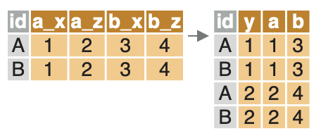
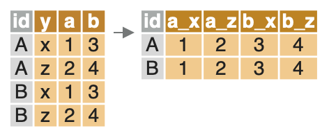

Avec mes collègues [Olivier Meslin](https://gitlab.com/oliviermeslin) de l'Insee et [Raphaële Adjerad](https://raphaele_adjerad.gitlab.io/website/) de la Drees, on a récemment écrit une introduction au package `{data.table}` pour des utilisateurs de `R` souhaitant le découvrir. Je la reprends dans ce post. Vous pouvez nous contacter par mail si besoin (<lino.galiana@insee.fr> et <olivier.meslin@insee.fr>).

Cette introduction ne se limite néanmoins pas à des débutants. Même des utilisateurs plus expérimentés de `R` mais ayant peu utilisé le *package* peuvent y trouver des informations utiles ! :nerd_face: 

> Pour dissocier le package du format de données, j'adopterai la syntaxe `{data.table}` pour parler du package et `data.table` pour parler des objets construits par le package (vous inquiétez pas, je vais revenir dessus).

Pour être certain de pouvoir exécuter toutes les commandes, ne pas oublier de charger le *package* avec `library(data.table)`.


Si vous êtes un lecteur pressé, vous pouvez directement passer à l'une des sections suivantes en cliquant sur le lien :


* [Import des données](#import)
* [Manipulations usuelles](#manipulation)
* [Enchaîner des opérations](#enchainer)
* [L'opérateur :=](#assignation)
* [Programmer des fonctions avec `data.table`](#fonctions)


# Principe {#principe}


## Pourquoi faire du `{data.table}` ?

`{data.table}` fournit tout un éco-système pour manipuler des données stucturées sous forme de `data.frame` (sélectionner des variables, sélectionner des observations, créer des variables, joindre des tables). Il s'agit d'un ensemble cohérent de commandes permettant de traiter des données en `R`, de manière très efficace.

`{data.table}` est particulièrement adapté aux données volumineuses (plus de 1Go) où l'utilisation de `{dplyr}` est vivement déconseillée :cop:. C'est la solution en `R` la plus adaptée pour le traitement de données si celles-ci ne sont pas structurées sous forme de base de données (par exemple `postgre`) ou si vous n'avez pas à disposition une infrastructure `Spark` (un *post* est prévu sur le sujet :open_mouth:). C'est aussi une solution très adaptée à la programmation fonctionnelle comme je l'ai déjà développé dans un [autre post de blog](/post/datatable/datatable-nse) (oui en ce moment je fais du prosélytisme ! :grin:). Je ne pense pas qu'il faille réserver `{data.table}` aux données volumineuses, la syntaxe est tellement puissante, une fois qu'on est habitué à celle-ci, que c'est un *package* extrêmement intéressant pour des *dataframes* de toute taille. 


> L'utilisation du *package* `{data.table}` peut paraître plus déroutante pour les débutants que l'utilisation de `{dplyr}`. Toutefois, l'apprentissage de `{data.table}` est particulièrement recommandé si vous avez l'intention d'utiliser `R` avec des données volumineuses car `{data.table}` est _beaucoup_ plus rapide et puissant que `{dplyr}`. Des remarques et conseils sont présents dans cette introduction pour vous aider à vous familiariser avec la syntaxe de `{data.table}`.


## Présentation du package

**Le *package* `{data.table}` propose une version améliorée du `data.frame` de base: le `data.table`.** La visualisation est améliorée par rapport à un `data.frame` standard:


```r
dt <- data.table(x = exp(rnorm(1e4)),
                 y = runif(1e4),
                 z = sample(1:4, 1e4, replace = TRUE))
dt
```

```
##                 x         y z
##     1: 1.15909799 0.6968217 3
##     2: 0.06887506 0.8209818 3
##     3: 1.19592560 0.4763069 4
##     4: 0.34173598 0.4672009 3
##     5: 4.78745379 0.7705325 1
##    ---                       
##  9996: 0.48549843 0.3020958 3
##  9997: 0.66327491 0.9178554 4
##  9998: 0.70554688 0.9364248 1
##  9999: 1.54994225 0.1853740 4
## 10000: 3.07076516 0.7186156 2
```

**La fonction fondamentale de `{data.table}` est l'opérateur `[...]` (crochets).** Dans un `data.frame` de base, les crochets `df[...]` servent uniquement à sélectionner des lignes ou des colonnes. Dans un `data.table`, les crochets `dt[...]` permettent de faire beaucoup plus de choses (quasiment tout, en pratique). En fait, les instructions à l'intérieur des crochets peuvent être envisagées comme des requêtes `SQL` mises en forme différemment. 

**La forme générale de l'opérateur `[...]` est la suivante: `DT[i, j, by]`**. Si on fait un parallèle avec `SQL`, `i` correspond au `WHERE`, `j` au `SELECT` et `by` au `GROUP BY`. Cette manipulation peut se lire comme ceci: "on part du `data.table` `DT`, on sélectionne certaines lignes avec `i`, puis on calcule `j` pour chaque groupe défini par `by`. La fonction `[...]` présente deux grands avantages:

- Il n'est pas nécessaire d'utiliser le préfixe `DT$` pour se référer aux variables à l'intérieur de `[...]`;
- Le code est très concis, ce qui aide à le rendre lisible.

Voici un exemple simple. A partir des données générées ci-dessus, on veut calculer la moyenne de `y` par groupe défini par `z`, uniquement sur les observations pour lesquelles `x` est supérieur à 3. Voici comment on peut réaliser cette opération avec `Base R`, `dplyr` et `data.table`. Vous pouvez juger vous-même de la concision du code.


<table class='table'>
<tr> <th>`Base R`</th> <th>`dplyr`</th> <th>`data.table`</th> <tr>
<tr>
<td>

```r
aggregate(
  dt[dt[["x"]] > 3]$y,
  by = list(dt[dt[["x"]] > 3]$z),
  FUN = sum)
```
</td>
<td>

```r
dt %>%
  dplyr::filter(x > 3) %>%
  dplyr::group_by(z) %>%
  dplyr::summarise(sum(y))
```
</td>
<td>

```r
dt[x > 3, sum(y), by = z]
```
</td>
<tr>
</table>


## Quelles fonctions peut-on utiliser avec un `data.table`?

**Les `data.tables` sont simplement des `data.frames` particuliers, donc on peut normalement leur appliquer toutes les méthodes valables pour les `data.frames`.** En particulier, on peut utiliser avec un `data.table` toutes les fonctions des *packages* habituellement associés à `{dplyr}`: `stringr` pour le maniement de chaînes de caractères, `lubridate` pour les colonnes temporelles, `forcats` pour les colonnes de type `factor`, etc. Toutefois, il est utile de vérifier que le *package* `{data.table}` ne propose pas déjà une fonction adaptée. Par exemple, plutôt que d'utiliser la fonction `stringr::str_split_fixed()` pour séparer une colonne en fonction d'un caractère, on utilisera `data.table::tstrsplit()`.


# Lire et écrire des données avec `{data.table}` {#import}

Le *package* `{data.table}` permet d'importer des fichiers plats avec la fonction `fread()`. Cette fonction présente trois avantages:

* Elle est très rapide pour importer de gros volumes de données (et nettement plus rapide que les fonctions du *package* `{readr}`);
* Elle permet de sélectionner facilement les colonnes qu'on veut importer (option `select`);
* Elle propose un grand nombre d'options, adaptées pour les usages avancés.

Les principales options de `fread()` sont les suivantes:

| Argument         | Valeur par défaut                           | Fonction                                                              |
|------------------|---------------------------------------------|-----------------------------------------------------------------------|
| `file`             | Aucune                                      | Le chemin du fichier à importer                                       |
| `sep`              | Le caractère le plus fréquent parmi `,\t |;:` | Le délimiteur du fichier                                              |
| `header`           | `fread()` essaie de deviner                 | La première ligne contient-elle les noms de colonnes?                 |
| `nrows`            | `Inf`                                         | Nombre maximum de lignes à importer (pas de limite par défaut)        |
| `skip`             | `0`                                           | Sauter les n premières lignes (0 par défaut)                          |
| `stringsAsFactors` | `FALSE`                                       | Les chaînes de caractères sont-elles traitées comme des facteurs?     |
| `select`           | `NULL`                                        | Sélectionner les colonnes à importer                                  |
| `drop`             | `NULL`                                        | Sélectionner les colonnes à ne pas importer                           |
| `colClasses`       | `fread()` essaie de deviner                 | Définir le type des variables                                         |
| `encoding`         | `"unknown"`                                   | Définir l'encodage du fichier (`"UTF-8"` ou `"Latin-1"`)                  |
| `dec`              | Le point                                      | Définir le marqueur décimal                                        |
| `data.table`       | `TRUE`                                        | `fread` renvoie un `data.table` si `TRUE`, un `data.frame` si `FALSE` |
| `showProgress`     | `TRUE`                                        | Indiquer la progression de l'importation                              |

Quelques remarques sur les options de `fread()`:

* `fread()` importe par défaut toutes les colonnes

    - L'option `select` permet de sélectionner les colonnes, et doit être égale à un vecteur de noms. Exemple: `select = c("var1", "var2", "var4")`;
    - Inversement, l'option `drop` permet de préciser quelles colonnes ne seront pas importées. Les options `select` et `drop` ne peuvent pas être utilisées en même temps.

* `fread()` essaie par défaut de deviner le type des colonnes (*integer* pour les nombres entiers, *character* pour les chaînes de caractères...). L'option `colClasses` permet de choisir le type des colonnes, et doit égale à un vecteur dont chaque élément est de la forme `nom_variable = "type"`. Exemple: `colClasses = c(var1 = "character", var2 = "logical", var4 = "double")`;
* l'option `stringsAsFactors = TRUE` peut ralentir sensiblement l'importation des données; il faut l'utiliser avec circonspection.

__Exemple 1:__ on veut importer le fichier des communes du code officiel géographique, en déclarant que le fichier est encodé en UTF-8 et en imposant que le code commune soit lu comme une chaîne de caractères et le code région comme un nombre entier. On écrit le code suivant:


```r
communes <- fread("./communes-01012019.csv",
                  colClasses = c(com = "character",
                                 reg = "integer"),
                  encoding = "UTF-8")
```

__Exemple 2:__ on veut réaliser la même importation que précédemment, mais en sélectionnant uniquement le code commune, le nom de la commune et la région. On écrit le code suivant:


```r
communes <- fread("./communes-01012019.csv",
                  select = c("com", "libelle", "reg"),
                  colClasses = c(com = "character",
                                 reg = "integer"),
                  encoding = "UTF-8")
```


# Manipulation de données usuelles avec `{data.table}` {#manipulation}

Il y a principalement deux méthodes pour mettre des données sous forme d'un `data.table`:

- La fonction `data.table::fread()` importe un fichier plat ;
- Les fonctions `data.table::setDT()` et `data.table::as.data.table()` convertissent un `data.frame` en `data.table`.

Dans la suite de cette section, on va illustrer les opérations de base en `{data.table}` avec le jeu de données `iris`, qu'on transforme en `data.table` pour l'occasion.


```r
iris_dt <- data.table::as.data.table(iris)
```


## Sélectionner des lignes

**On peut sélectionner des lignes dans un `data.table` avec `dt[i]`.** Exemple: on séléctionne les lignes de `iris_dt` correspondant à l'espèce "Setosa":

```r
selection <- iris_dt[Species == "setosa"]
```

> **Remarque très importante**
>
> **Lorsqu'on souhaite conserver toutes les lignes d'un `data.table`, il faut laisser vide l'emplacement pour `i`, sans oublier la virgule.** Par exemple, pour connaître le nombre de lignes de `iris_dt`, on écrit: `iris_dt[ , .N]`.  Notez bien l'emplacement vide et la virgule après `[`.


## Sélectionner des colonnes

**On peut sélectionner des colonnes dans un `data.table` et renvoyer un `data.table` de plusieurs façons**. 

- La première consiste à indiquer les colonnes à conserver sous forme de liste. La notation `.()` est un alias pour `list()` qui est assez pratique en `{data.table}`. 


```r
iris_dt[ , list(Petal.Width, Species)]
iris_dt[ , .(Petal.Width, Species)]
```

- La seconde méthode consiste à utiliser un mot-clé de `{data.table}`, `.SD` qui signifie `Subset of Data`. On indique les colonnes qui seront aliasées par `.SD` avec la dimension `.SDcols`. 


```r
iris_dt[ , .SD, .SDcols = c("Petal.Width", "Species")]
```

> **Remarque**
>
> La seconde méthode peut vous sembler inutilement complexe. C'est vrai dans l'exemple donné ci-dessus, mais les fonctions `.SD` et `.SDcols` s'avèrent très puissantes dans un grand nombre de situations (notamment quand on veut programmer des fonctions qui font appel à `{data.table}`). Si ça vous intéresse, vous pouvez aller [plus loin](#fonctions) dans cette documentation ou lire mon [précédent post](/post/datatable/datatable-nse)


### Trier un `data.table`

**On peut trier un `data.table` avec la fonction `order()`.** On trie `iris_dt` dans l'ordre croissant de `Sepal.Length` et dans l'ordre décroissant de la variable `Sepal.Width`.


```r
iris_dt[order(Sepal.Length, -Sepal.Width)]
```

```
##      Sepal.Length Sepal.Width Petal.Length Petal.Width   Species
##   1:          4.3         3.0          1.1         0.1    setosa
##   2:          4.4         3.2          1.3         0.2    setosa
##   3:          4.4         3.0          1.3         0.2    setosa
##   4:          4.4         2.9          1.4         0.2    setosa
##   5:          4.5         2.3          1.3         0.3    setosa
##  ---                                                            
## 146:          7.7         3.8          6.7         2.2 virginica
## 147:          7.7         3.0          6.1         2.3 virginica
## 148:          7.7         2.8          6.7         2.0 virginica
## 149:          7.7         2.6          6.9         2.3 virginica
## 150:          7.9         3.8          6.4         2.0 virginica
```

### Calculer des statistiques

**La méthode pour sélectionner des colonnes est également valable pour calculer des statistiques, car `data.table` accepte les expressions dans `j`.** Ainsi, pour calculer la moyenne de la variable `Sepal.Length`, on écrit:

```r
ans <- iris_dt[ , sum(Sepal.Length, na.rm = TRUE)]
ans 
```

```
## [1] 876.5
```

```r
# ou plus simplement
iris_dt[ , sum(Sepal.Length, na.rm = TRUE)]
```

```
## [1] 876.5
```

Si on veut calculer plusieurs statistiques à la fois (par exemple la moyenne et l'écart-type), on peut utiliser la notation `.()` dans `j`, et on peut donner des noms aux variables:

```r
ans <- iris_dt[ , .(sd = sd(Sepal.Length, na.rm = TRUE), 
                    moyenne = sum(Sepal.Length, na.rm = TRUE))]
ans 
```

```
##           sd moyenne
## 1: 0.8280661   876.5
```

```r
# ou plus simplement
iris_dt[ , .(sd = sd(Sepal.Length, na.rm = TRUE), 
             moyenne = sum(Sepal.Length, na.rm = TRUE))]
```

```
##           sd moyenne
## 1: 0.8280661   876.5
```

**On peut évidemment combiner `i` et `j` pour calculer la moyenne pour un groupe particulier.** Dans l'exemple suivant, on sélectionne l'espèce "setosa" (avec `i`), ensuite on sélectionne et on calcule en même temps (avec `j`). 

```r
ans <- iris_dt[Species == "setosa", .(moyenne = sum(Sepal.Length, na.rm = TRUE))]
ans
```

```
##    moyenne
## 1:   250.3
```

## Les fonctions statistiques utiles de `{data.table}`

Vous pouvez utiliser toutes les fonctions statistiques de `R` avec `{data.table}`. Le *package* `{data.table}` propose par ailleurs des fonctions optimisées qui peuvent vous être utiles. En voici quelques-unes:

| Fonction        | Opération                                         | Exemple     |
|-----------------|---------------------------------------------------|-------------------------------------------------------------|
|`.N`             | Nombre d'observations                             | `dt[ , .N, by = 'group_var']` |
|`uniqueN()`      | Nombre d'observations uniques de la variable `x`  | `dt[ , uniqueN(x)]` ; `dt[ , uniqueN(x), by = 'group_var']` |
|`%in%`           | Nombre dans la liste                              | `dt[x %in% 1:5]` |
|`%chin%`         | Mot dans la liste                                 | `dt[x %chin% c("a", "b")]` |
|`%between%`      | Valeur entre deux nombres                         | `dt[x %between% c(5,13)]` |
| `%like%`        | Reconnaissance d'une chaîne de caractères         | `dt[departement %like% "^Haute"]`

## Opérations par groupe

**Toutes les opérations précédentes peuvent être réalisées par groupe.** il suffit d'ajouter le nom des variables de groupe dans `by` (c'est l'équivalent du `dplyr::group_by()`). Lorsqu'il y a plusieurs variables de groupe, il faut écrire `by = c("var1", "var2", "var3")`. Par exemple, on peut calculer la moyenne de la variable `Sepal.Length` par espèce de fleur:


```r
ans <- iris_dt[ , .(moyenne = sum(Sepal.Length, na.rm = TRUE)), by = "Species"]
ans 
```

```
##       Species moyenne
## 1:     setosa   250.3
## 2: versicolor   296.8
## 3:  virginica   329.4
```

## Joindre des tables avec `{data.table}`

Pour joindre des données, `{data.table}` propose une fonction `merge()` plus rapide que la fonction de base. La syntaxe générale est `z <- merge(x, y, [options])`. Voici une liste des principales options (les autres options sont visibles avec `?data.table::merge`):

| **Option**                                | **Signification**                                                        |
|-------------------------------------------|--------------------------------------------------------------------------|
| `by = var_jointure`                       | Joindre sur la variable `var_jointure` (présente dans `x` et dans `y`)   |
| `by.x = "identx", by.y = "identy"`        | Joindre sur la condition `identx == identy`                              |
|`all.x = TRUE`                             | *Left join* (garder toutes les lignes de `x`)                            |
|`all.y = TRUE`                             | *Right join* (garder toutes les lignes de `y`)                           |
|`all = TRUE`                               | *Full join* (garder toutes les lignes de `x` et de `y`)                  |

Enfin, il est possible de réalier des jointures plus sophistiquées avec `{data.table}`. Ces méthodes sont présentées dans la [vignette sur le sujet](https://rstudio-pubs-static.s3.amazonaws.com/52230_5ae0d25125b544caab32f75f0360e775.html).

## Indexer une table avec `{data.table}`

**L'indexation est une fonctionalité très puissante pour accélérer les opérations sur les lignes (filtres, jointures, etc.) en `data.table`**. Pour indexer une table il faut déclarer les variables faisant office de clé (appelées `key`). C'est possible de la manière suivante: `data.table::setkey(dt, a)`  ou `data.table::setkeyv(dt, "a")`. Le `data.table` sera réordonné en fonction de cette variable et l'algorithme de recherche sur les lignes sera ainsi beaucoup plus efficace. 
Lorsqu'il y a plusieurs variables-clé, on écrit `data.table::setkey(dt, a, b)` ou `data.table::setkeyv(dt, c("a","b"))`.
Pour savoir si un `data.table` est déjà indexé, on peut exécuter la commande `key(dt)` qui renvoie le nom des clés s'il y en a, et `NULL` sinon.

> **Conseil**
>
> **L'exécution de la fonction `data.table::setkey()` peut prendre un peu de temps** (parfois quelques minutes sur une table de plus de 10 millions de lignes), car `data.table` trie toute la table en fonction des variables-clé. Toutefois, c'est une étape vraiment utile car elle accélère considérablement les opérations ultérieures sur les lignes. Il est vivement recommandé de l'utiliser si une ou plusieurs variables vont régulièrement servir à filtrer ou combiner des données. Pour aller plus loin, voir cette [vignette](https://cran.r-project.org/web/packages/data.table/vignettes/datatable-keys-fast-subset.html).

## Réorganiser les données en `data.table`

**Le *package* `data.table` permet de réorganiser facilement une table de données avec les fonctions `dcast()` et `melt()`.** La fonction `melt()` réorganise les donnée dans un format long. La fonction `melt()` réorganise les donnée dans un format large.

| **`melt()`**                                         | **`dcast()`**                                    |
| :--------------------------------------------------: | :----------------------------------------------: |
| Réorganiser les donnée dans un format long           | Réorganise les données dans un format large       |
|{width=55%}       |{width=62%}   |

L'utilisation de ces fonctions est illustrée avec la table `mtcars`, transformée en `data.table`.


```r
mtcars_dt <- data.table(mtcars)
head(mtcars_dt)
```

```
##     mpg cyl disp  hp drat    wt  qsec vs am gear carb
## 1: 21.0   6  160 110 3.90 2.620 16.46  0  1    4    4
## 2: 21.0   6  160 110 3.90 2.875 17.02  0  1    4    4
## 3: 22.8   4  108  93 3.85 2.320 18.61  1  1    4    1
## 4: 21.4   6  258 110 3.08 3.215 19.44  1  0    3    1
## 5: 18.7   8  360 175 3.15 3.440 17.02  0  0    3    2
## 6: 18.1   6  225 105 2.76 3.460 20.22  1  0    3    1
```

### Réorganiser les données en format long (*wide to long*)

La fonction `melt()` réorganise les donnée dans un format long. Elle prend les arguments suivants:

* `data`: les données;
* `id.vars`: les variables qui identifient les lignes de table d'arrivée; elles restent inchangées
* `measure.vars`: les variables qui sont transposées;
* `variable.name`: le nom de la nouvelle colonne qui contient le nom des variables transposées;
* `value.name`: le nom de la nouvelle colonne qui contient la valeur des variables transposées.

Dans l'exemple qui suit, on réorganise la table `mtcars_dt` de façon à obtenir une table qui garde inchangées les colonnes `cyl` et `gear`, et comprend une ligne pour chacune des variables `mpg`, `disp`, `hp` et `wt`. Le nom et la valeur de chaque variable sont renseignées dans les colonnes `nom_de_variable` et `valeur_de_variable`.


```r
mtcars_dt_melted <- melt(mtcars_dt, 
  c("cyl", "gear"), 
  measure.vars = c("mpg", "disp", "hp", "wt"),
  variable.name = "nom_de_variable",
  value.name    = "valeur_de_variable"
  )
head(mtcars_dt_melted)
```

```
##    cyl gear nom_de_variable valeur_de_variable
## 1:   6    4             mpg               21.0
## 2:   6    4             mpg               21.0
## 3:   4    4             mpg               22.8
## 4:   6    3             mpg               21.4
## 5:   8    3             mpg               18.7
## 6:   6    3             mpg               18.1
```

### Réorganiser les données en format large (*long to wide*)

La fonction `dcast()` réorganise les donnée dans un format large. Elle prend les arguments suivants:

* `data`: les données;
* `formula`: une formule de la forme `var_ligne ~ var_colonne` qui définit la structure de la nouvelle table; 
    - s'il y a plusieurs variables, la formule prend la forme `var1 + var2 ~ var3`;
    - `dcast()` conserve une ligne par valeur de la partie gauche, et crée (au moins) une colonne par valeur de la partie droite;
* `fun.aggregate`: une liste contenant la ou les fonction(s) utilisées pour agréger les données le cas échéant; exemple: `list(mean, sum, sd)`;
*  `value.var`: un vecteur contenant le nom de la ou des colonne(s) dont les valeurs vont être transposées; exemple: `c("var1", "var2")`

Dans l'exemple qui suit, on réorganise la table `mtcars_dt` de façon à obtenir une table qui contient une ligne par valeur de `gear` et une colonne par valeur de `cyl`. Ces colonnes vont contenir la moyenne de la variable `disp`.

```r
mtcars_dt_casted <-   dcast(mtcars_dt, 
                            gear ~ cyl, 
                            value.var = "disp", 
                            fun.aggregate = mean)
head(mtcars_dt_casted)
```

```
##    gear       4     6        8
## 1:    3 120.100 241.5 357.6167
## 2:    4 102.625 163.8      NaN
## 3:    5 107.700 145.0 326.0000
```

Il est possible d'utiliser `dcast()` avec plusieurs variables à transposer et plusieurs fonctions pour transposer. Dans l'exemple qui suit, on obtient une colonne par valeur de `cyl`, par variable transposée (`disp` et `mpg`) et par fonction d'agrégation (`mean` et `sum`).


```r
# On ne conserve que cyl == 4 pour réduire le nombre de colonnes créées
mtcars_dt_casted2 <-   
  dcast(mtcars_dt[cyl == 4], 
        gear ~ cyl, 
        value.var = c("disp", "mpg"), 
        fun.aggregate = list(mean, sum))
head(mtcars_dt_casted2)
```

```
##    gear disp_mean_4 mpg_mean_4 disp_sum_4 mpg_sum_4
## 1:    3     120.100     21.500      120.1      21.5
## 2:    4     102.625     26.925      821.0     215.4
## 3:    5     107.700     28.200      215.4      56.4
```

**Conseils**: 

* La fonction `dcast()` crée une colonne par valeur des variables utilisées dans la partie droite de la formule (trois colonnes pour les trois valeurs de `cyl` dans l'exemple qui précède). **Il faut donc faire attention à ce que ces variables aient un nombre limité de valeurs**, pour ne pas obtenir une table *extrêmement* large. On peut éventuellement discrétiser les variables continues, ou regrouper les modalités avant d'utiliser `dcast()`.
* On peut obtenir des **noms de colonnes peu significatifs** lorsqu'on utilise `dcast()` avec une colonne numérique et une fonction d'agrégation (`4`, `6`, `8` dans l'exemple précédent). Il est conseillé de modifier légèrement la partie droite de la formule pour obtenir des noms plus significatifs. Voici un exemple:
  
  ```r
  head(mtcars_dt_casted2 <- dcast(mtcars_dt, 
                                  gear ~ paste0("cyl", cyl), 
                                  value.var = "disp", 
                                  fun.aggregate = mean))
  ```
  
  ```
  ##    gear    cyl4  cyl6     cyl8
  ## 1:    3 120.100 241.5 357.6167
  ## 2:    4 102.625 163.8      NaN
  ## 3:    5 107.700 145.0 326.0000
  ```


```r
dcast(mtcars_dt, gear ~ cyl, value.var = c("disp", "hp"), fun = list(mean, sum))
```

```
##    gear disp_mean_4 disp_mean_6 disp_mean_8 hp_mean_4 hp_mean_6 hp_mean_8
## 1:    3     120.100       241.5    357.6167        97     107.5  194.1667
## 2:    4     102.625       163.8         NaN        76     116.5       NaN
## 3:    5     107.700       145.0    326.0000       102     175.0  299.5000
##    disp_sum_4 disp_sum_6 disp_sum_8 hp_sum_4 hp_sum_6 hp_sum_8
## 1:      120.1      483.0     4291.4       97      215     2330
## 2:      821.0      655.2        0.0      608      466        0
## 3:      215.4      145.0      652.0      204      175      599
```


# Enchaîner les opérations en `{data.table}` {#enchainer}

## Le principe est simple...

**Il est facile d'enchaîner des opérations avec `data.table`: il suffit d'accoler les opérateurs `[]`.** Votre code `{data.table}` prendra alors la forme suivante: `dt[opération 1][opération 2][opération 3][...]`. Voici un exemple simple, dans lequel on calcule la moyenne d'une variable par groupe, puis on trie la table.


```r
# En chaînant
ans <- iris_dt[ , .(moyenne = mean(Sepal.Length, na.rm = TRUE)), by = Species][order(moyenne)]
ans
```

```
##       Species moyenne
## 1:     setosa   5.006
## 2: versicolor   5.936
## 3:  virginica   6.588
```

## ... mais il faut que le code reste lisible

Le problème avec l'enchaînement d'opérations multiples est qu'on aboutit rapidement à des lignes de codes extrèmement longues. C'est pourquoi **il est préférable de revenir régulièrement à la ligne, de façon à garder un code qui reste lisible.** Il y a évidemment plusieurs façons d'organiser le code. Le seul principe est que le crochet qui commence une nouvelle opération doit être accolé au crochet qui termine l'opération précédente (`...][...`). Voici une organisation possible: 


```r
resultat <- 
  dt[i = ...,
     j = ...,
     by = ...
     ][i = ...,
       j = ...,
       by = ...
       ]
```

Ce n'est néanmoins pas très lisible. Il est préférable de faire:


```r
resultat <- dt[i = ...,
               j = ...,
               by = ...
               ]
resultat <- resultat[i = ...,
                     j = ...,
                     by = ...
                     ]
```


Comme vu précédemment, `i`, `j` et `by` ne sont pas forcément présents dans toutes les étapes. Voici ce que cette organisation du code donne sur un exemple légèrement plus complexe que le précédent:


```r
iris_dt[ , Total.Length := Sepal.Length + Petal.Length]

resultat <- iris_dt[ ,.(moyenne = mean(Total.Length, na.rm = TRUE)),
              by = Species]
resultat <- resultat[order(moyenne)]
resultat
```

```
##       Species moyenne
## 1:     setosa   6.468
## 2: versicolor  10.196
## 3:  virginica  12.140
```


> **Remarque**
>
> **L'enchaînement des opérations en `{data.table}` est puissant, mais peut aboutir à des résultats non désirés si on ne fait pas attention.** Les exemples de cet encadré utilisent la fonction `:=`; si vous ne la connaissez pas encore, il est conseillé de lire la section [La fonction d'assignation par référence (ou `:=`)] avant de poursuivre la lecture. 

Voici deux exemples d'opérations enchaînées en `{data.table}` dont le code est très proche et qui aboutissent à des résultats très différents. Le premier exemple ne conserve qu'une partie de la table `dt` puis crée une variable, tandis que le second crée une variable avec une valeur non manquante pour une partie de la table uniquement.


<table class='table'>
<tr> <th> </th> <th>Exemple 1</th> <th>Exemple 2</th> <tr>
<tr>
<td>
**Code**
</td>
<td>

```r
dt[x > 3][ , newvar := 1]
```
</td>
<td>

```r
dt[x > 3, newvar := 1]
```
</td>
</tr>
<tr> 
<th>Signification </th> 
<th>Partir de `dt`, conserver uniquement les observations pour lesquelles `x > 3`, et créer une nouvelle variable `newvar` qui vaut 1 partout </th> 
<th>Partir de `dt`, créer une nouvelle variable `newvar` qui vaut 1 pour les observations pour lesquelles `x > 3` et `NA` ailleurs</th> <tr>
</table>


# La fonction d'assignation par référence (ou `:=`) {#assignation}

Jusqu'à présent, nous avons manipulé un `data.table` existant, mais nous ne lui avons pas ajouté de nouvelles colonnes. Pour ce faire, nous allons utiliser la fonction `:=` (qui s'appelle "*assignation par référence*" et qui peut également s'écrire `` `:=`() ``). Voici comment on crée une nouvelle colonne dans `iris_dt`:


```r
iris_dt[ , nouvelle_colonne :=  Petal.Width * 10]
head(iris_dt)
```

```
##    Sepal.Length Sepal.Width Petal.Length Petal.Width Species Total.Length
## 1:          5.1         3.5          1.4         0.2  setosa          6.5
## 2:          4.9         3.0          1.4         0.2  setosa          6.3
## 3:          4.7         3.2          1.3         0.2  setosa          6.0
## 4:          4.6         3.1          1.5         0.2  setosa          6.1
## 5:          5.0         3.6          1.4         0.2  setosa          6.4
## 6:          5.4         3.9          1.7         0.4  setosa          7.1
##    nouvelle_colonne
## 1:                2
## 2:                2
## 3:                2
## 4:                2
## 5:                2
## 6:                4
```

## La spécificité de `{data.table}`: la modification par référence

**A première vue, on peut penser que la fonction `:=` est l'équivalent de la fonction `dplyr::mutate()` dans la grammaire `{data.table}`.** C'est vrai dans la mesure où elle permet de faire des choses similaires, mais il faut garder en tête que son fonctionnement est complètement différent de celui de `dplyr::mutate()`. En effet, **la grande spécificité de `{data.table}` par rapport à `{dplyr}` est que l'utilisation de la fonction `:=` modifie directement la table de données**, car  `{data.table}` fonctionne sur le principe de la modification par référence (voir [ce lien](https://gitlab.com/linogaliana/bigr/-/blob/master/04-datatable.Rmd)
pour plus de détails). Cela signifie en pratique qu'**il ne faut pas réassigner l'objet lorsqu'on modifie une de ses colonnes**. C'est ce comportement qui permet à `{data.table}` d'être très rapide et très économe en mémoire vive, rendant son usage approprié pour des données volumineuses. 

Pour créer une colonne, on écrit donc directement `dt[ , nouvelle_colonne := une_formule]` et non `dt <- dt[ , nouvelle_colonne := une_formule]`. Voici un exemple qui compare `{dplyr}` et `{data.table}`:

<table class='table'>
<tr> <th>`dplyr` : Il faut une assignation (`<-`) pour modifier `iris`</th> <th>`data.table`: Il ne faut pas d'assignation pour modifier `iris_dt`</th> <tr>
<tr>
<td>

```r
iris <- iris %>%
  dplyr::mutate(nouvelle_colonne =  Petal.Width * 10)
```
</td>
<td>

```r
iris_dt[ , nouvelle_colonne :=  Petal.Width * 10]
```
</td>
</tr>
</table>


## Les usages de `:=`

On peut se servir de la fonction `:=` de multiples façons, et avec plusieurs notations.

### Créer plusieurs variables à la fois

Voici comment créer plusieurs variables à la fois avec `:=`, en utilisant une notation vectorielle:

```r
iris_dt[ , c("nouvelle_colonne1", "nouvelle_colonne2") :=  
           list(Petal.Width * 10, Petal.Length * 20)]
```

On peut faire exactement la même chose en utilisant la notation `` `:=`() ``. Voici le même exemple écrit avec `` `:=`() ``.


```r
iris_dt[ , `:=`(nouvelle_colonne1 =  Petal.Width * 10,
                nouvelle_colonne2 =  Petal.Length * 20)]
```

**Remarque**

Si vous utilisez la notation`` `:=`() ``, alors il faut utiliser uniquement `=` à l'intérieur des parenthèses pour créer ou modifier des variables, et non `:=`. Exemple:

```r
dt[ , `:=`(var1 = "Hello", var2 = "world")]
```

### Supprimer une colonne

On peut facilement supprimer une colonne en lui assignant la valeur `NULL` (c'est hyper rapide!). Voici un exemple:

```r
iris_dt[ , colonne_existante := NULL]
```


### Faire un remplacement conditionnel

La fonction `:=` peut être utilisée pour modifier une colonne pour certaines lignes seulement, en fonction d'une condition logique. C'est beaucoup plus efficace qu'un terme `dplyr::if_else()` ou `dplyr::case_when()`. Imaginons qu'on veuille créer une colonne `x` qui vaut `Petal.Length` sauf pour les lignes où `Species` est `setosa` où elle vaut `NA`. Dans ce cas, le code `{dplyr}` serait:


```r
iris %>% 
  dplyr::mutate(x = dplyr::case_when(
    Species ~ "setosa" == NA_real_,
    TRUE ~ Petal.Length)
  )
```

et le code équivalent en `{data.table}`, nécessitant beaucoup moins de mémoire vive:


```r
iris_dt[ , "x" := Petal.Length]
iris_dt[Species == "setosa", x := NA_real_]
```

## Attention en utilisant `:=`

L'utilisation de la fonction `:=` est déroutante lorsqu'on découvre `{data.table}`. Voici trois remarques qui vous feront gagner du temps:

- **Vous pouvez faire appel à d'autres fonctions à l'intérieur de la fonction `:=`.** Par exemple, si on veut mettre la variable `name` en minuscules, on peut utiliser la fonction `tolower()`. On écrit alors: 
  
  ```r
  dt[ , name_minuscule := tolower(name)]
  ```

- Lorsque l'on crée plusieurs variables avec la fonction `:=`, elles sont créées en même temps. **On ne peut donc pas faire appel dans une formule à une variable qu'on crée dans le même appel à la fonction `:=`.** Par exemple, le code suivant _ne fonctionne pas_:
  
  ```r
  dt[ , `:=`(nouvelle_colonne1 =  Petal.Width * 10,
             nouvelle_colonne2 =  nouvelle_colonne1 + 5)]
  ```

En effet, au moment où la fonction `:=` est exécutée, la colonne `nouvelle_colonne1` n'existe pas encore, donc la formule `nouvelle_colonne2 =  nouvelle_colonne1 + 5` n'a pas encore de sens. Si vous créez des variables en chaîne, il faut décomposer l'opération en plusieurs étapes enchaînées. Voici le code qui permet de créer les deux colonnes à la suite:
  
  
  ```r
  dt[ , `:=`(nouvelle_colonne1 :=  Petal.Width * 10]
  dt[ , nouvelle_colonne2 :=  nouvelle_colonne1 + 5)]
  ```

- **Un mauvais usage de la fonction `:=` peut vous amener à écraser par erreur vos données.** En effet, si vous exécuter par erreur la commande `dt[ , ma_variable_importante := 0]`, vous écrasez la variable `ma_variable_importante`. Vous devez alors recharger vos données... Il faut donc bien réfléchir à ce que vous voulez faire avant de remplacer une variable avec la fonction `:=`. Si vous modifiez un `data.table` dans une fonction, un filet de sécurité consiste à d'abord copier le `data.table` initial et ainsi faire les modifications sur le nouvel objet, de la manière suivante:

  
  ```r
  modif_variable <- function(dt, variable = "x"){
    dt_copy <- data.table::copy(dt)
    # On utilise get() lorsqu'on utilise un nom de variable avec des quotes 
    dt_copy[,c(variable) := get(variable) + 1] 
    return(dt_copy)
  }
  ```

# Programmer des fonctions avec `data.table` {#fonctions}

## Utiliser `.SD` et `lapply`

Le mot clé `.SD` (*Subset of Data*) permet d'appliquer la même opération sur plusieurs colonnes. Les colonnes auxquelles l'opération s'applique sont contrôlées par l'argument `.SDcols` (par défaut, toutes les colonnes sont traitées). Le mot clé `.SD` est régulièrement utilisé en conjonction avec la fonction `lapply`.
**Cette syntaxe, très puissante, permet également d'avoir des codes assez compacts, ce qui les rend plus lisible.**

Un usage classique de ce duo `lapply`+`.SD` consiste à écrire des fonctions de statistiques descriptives. Par exemple, imaginons qu'on souhaite calculer la moyenne, la variance et les quantiles (P25, P50 et P75) de nombreuses colonnes. On peut alors définir la fonction suivante:


```r
mes_statistiques <- function(x) return(c(mean(x), var(x), quantile(x, probs = c(.25,.5,.75))))
```

et l'appliquer aux deux colonnes `Petal.Width` et `Petal.Length` de la manière suivante:


```r
data_agregee <- iris_dt[ ,
                         lapply(.SD, mes_statistiques), 
                         .SDcols = c("Petal.Width","Petal.Length")]
data_agregee[, 'stat' := c("moyenne","variance","P25","P50","P75")]
data_agregee
```

```
##    Petal.Width Petal.Length     stat
## 1:   1.1993333     3.758000  moyenne
## 2:   0.5810063     3.116278 variance
## 3:   0.3000000     1.600000      P25
## 4:   1.3000000     4.350000      P50
## 5:   1.8000000     5.100000      P75
```

Il est très simple d'effectuer des calculs par groupe avec la méthode `lapply`+`.SD`. On peut par exemple facilement adapter le code précédent pour calculer des statistiques descriptives par espèce de fleur (variable `Species`). 


```r
data_agregee <- iris_dt[ ,
                         lapply(.SD, mes_statistiques), 
                         by = "Species", 
                         .SDcols = c("Petal.Width","Petal.Length")]
data_agregee[, 'stat' := c("moyenne","variance","P25","P50","P75"), by = "Species"]
data_agregee
```

## Définir des fonctions modifiant un `{data.table}`

**Il est très facile d'écrire avec `data.table` des fonctions génériques faisant appel à des noms de variables en arguments.** Pour déclarer à `{data.table}` qu'un nom fait référence à une colonne, la manière la plus simple est d'utiliser la fonction `get`. Dans l'exemple suivant, on définit la fonction `creation_var` qui crée dans la table `data` une nouvelle variable (dont le nom est l'argument `nouveau_nom`) égale à une autre variable incrémentée (dont le nom est l'argument `nom_variable`) de 1. L'utilisation de `get` permet d'indiquer à `{data.table}` que la chaîne de caractères `nom_variable` désigne une colonne de la table `data`.


```r
creation_var <- function(data, nom_variable, nouveau_nom = "x"){
  data[,c(nouveau_nom) := get(nom_variable)+1]
}
head(creation_var(iris_dt, "Petal.Width","toto"),2)
```

```
##    Sepal.Length Sepal.Width Petal.Length Petal.Width Species Total.Length
## 1:          5.1         3.5          1.4         0.2  setosa          6.5
## 2:          4.9         3.0          1.4         0.2  setosa          6.3
##    nouvelle_colonne  x toto
## 1:                2 NA  1.2
## 2:                2 NA  1.2
```

`c(nouveau_nom)` permet de s'assurer que `{data.table}` crée une nouvelle colonne avec le nom défini en argument et pas en l'appelant `nouveau_nom`. Le code équivalent en `{dplyr}` est beaucoup moins lisible et est moins général car il ne permet pas de définir en argument le nouveau nom de la variable.

<!---**Remarque**---->

Il est particulièrement complexe d'écrire avec `{dplyr}` des fonctions génériques faisant appel à des noms de variables en arguments: il est nécessaire de faire appel à plusieurs fonctionnalités de `{rlang}` pour être en mesure d'effectuer une opération équivalente. Voici pour information la version `{dplyr}` de l'exemple précédent:


```r
modif_var <- function(data, nom_variable){
  data %>% dplyr::mutate(nouveau_nom = !!rlang::sym(nom_variable)+1]
}
```
C'est l'une des raisons pour lesquelles il est préférable d'utiliser `{data.table}` lorsqu'on souhaite manipuler fréquemment des données à l'aide de fonctions. Le lecteur intéressé par la question pourra consulter ce [post](https://linogaliana.netlify.com/post/datatable/datatable-nse/) sur le sujet.
:::

> **Conseil**
> 
> Lorsqu'on définit des fonctions pour effectuer des traitements génériques, il est conseillé de privilégier `data.table` sur `dplyr`. Une précaution est néanmoins nécessaire pour ne pas modifier les données en entrée de la fonction si l'opérateur `:=` est utilisée. Il est recommandé dans ce cas de créer une copie du dataframe en entrée (`data.table::copy(df)`) et d'effectuer les traitements sur cette copie. 


# Références

- la [documentation officielle](https://www.rdocumentation.org/packages/data.table) de `data.table` (en anglais);
- les [vignettes](https://github.com/Rdatatable/data.table/wiki/Getting-started) de `data.table`:
    - [Introduction à `data.table`](https://cloud.r-project.org/web/packages/data.table/vignettes/datatable-intro.html) (en anglais);
    - [Modification par référence](https://cloud.r-project.org/web/packages/data.table/vignettes/datatable-reference-semantics.html) (en anglais);
    - [la foire aux questions de `data.table`](https://cran.r-project.org/web/packages/data.table/vignettes/datatable-faq.html) (en anglais);
- une [_cheatsheet_](https://github.com/rstudio/cheatsheets/raw/master/datatable.pdf) sur `data.table` (en anglais);
- une [introduction à l'utilisation de l'opérateur `[...]`](https://stt4230.rbind.io/tutoriels_etudiants/hiver_2017/data.table) (en français);
- Ce [cours complet sur `data.table`](https://gitlab.com/linogaliana/bigr/-/blob/master/04-datatable.Rmd) (en français).
- Cette [présentation des fonctionalités du package](https://dreamrs.github.io/talks/20180528_RAddicts_datatable.pdf) (en français).
- Ce [post sur les fonctions utilisant data.table](https://linogaliana.netlify.com/post/datatable/datatable-nse/) 
