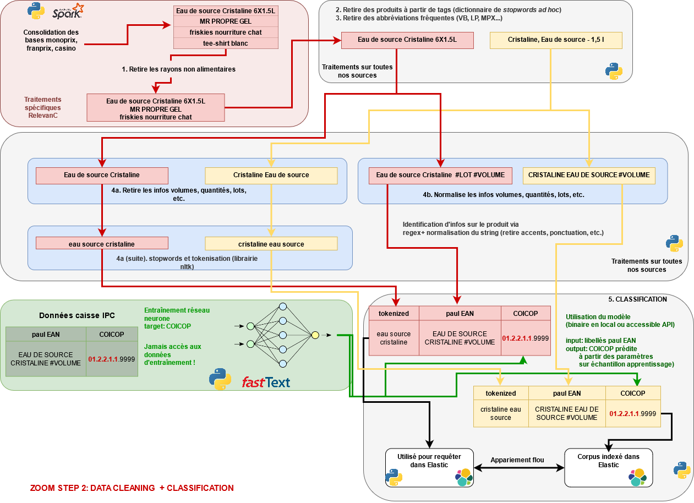

`foodbowl` est un package `Python` conçu pour réaliser des appariements
flous en s'appuyant sur `ElasticSearch`. 

Il a été construit dans l'objectif de réaliser une étude sur la cartographie
de la consommation d'aliments gras, sucrés et salés. 

Voici une image du *pipeline* d'appariement mis en oeuvre:

Plus de détails sont disponibles dans la présentation faite en décembre 2021
sur le sujet qui est
[disponible ici](https://epic-davinci-acb57b.netlify.app/#1)
