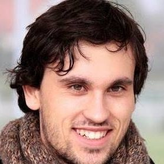

::: {#hero-banner .column-screen}

:::: {.grid .column-page}

::::: {.headline .g-col-lg-8 .g-col-12 .g-col-md-12}

I am a data scientist at the Innovation Lab of the French National Institute of Statistics ([Insee](https://www.insee.fr/fr/accueil)) 🇫🇷. My work focuses on leveraging new data sources and innovative methods to develop reliable statistics on socioeconomic phenomena. I have a particular interest in the analysis of textual and spatial data.

I mostly work with `Python` ,  and `Javascript` . Most of my work, both personal and professional, is available on my  [GitHub page](https://github.com/linogaliana) or the  [GitHub page](https://github.com/inseefrlab) of Insee's Lab.

I currently teach [*Python for Data Scientists*](https://pythonds.linogaliana.fr/)  at [ENSAE Paris Tech](https://www.ensae.fr/), one of France's top engineering schools. You can find the course materials on the [GitHub repository](https://github.com/linogaliana/python-datascientist) .

Additionally, I teach a course on [_Data Science Projects in Production_](https://ensae-reproductibilite.github.io/website/) at the same institution. This course addresses state-of-the-art MLOps practices, with materials available on the [GitHub repository](https://github.com/ensae-reproductibilite/website) .

I have developed a course on [Good Practices in `R` and `Git`](https://inseefrlab.github.io/formation-bonnes-pratiques-git-R/). Additionally, I used to teach an [Introduction to ](https://rgeo.linogaliana.fr/) ([GitHub repository](https://github.com/linogaliana/r-geographie) ), an introductory data analysis course at [Ecole Normale Supérieure](https://www.geographie.ens.psl.eu/introduction-aux-methodes.html).

Among my main open-source projects, I maintain the [`utilitR` project](https://www.utilitr.org/), a collective effort involving many contributors from the French administration to provide high-quality documentation for the  software. I also developed [`cartiflette`](https://inseefrlab.github.io/cartiflette-website/), a project designed to offer data scientists working with spatial data easy access to France's geographic borders, facilitating the production of maps.

Since I enjoy using my professional tools for personal projects, I developed [climbtracker](https://github.com/linogaliana/climbtracker) ⛰️🚲, a website that helps road cyclists find ascents in their surrounding areas.


:::::

::::: {.g-col-lg-4 .g-col-12 .g-col-md-12 .text-center}

{.rounded}

```{=html}
<a class="btn btn-outline-dark", href="https://github.com/linogaliana" target="_blank" rel="noopener noreferrer">
    <i class="bi bi-github" role='img' aria-label='Github'></i>
</a>

<a class="btn btn-outline-dark", href="https://www.linkedin.com/in/linogaliana/" target="_blank" rel="noopener noreferrer">
    <i class="bi bi-linkedin" role='img' aria-label='LinkedIn'></i>
</a>
```

:::::

::::: {.headline .g-col-lg-8 .g-col-12 .g-col-md-12}

## Teaching

I recently gave the following courses:

::::::{#teaching}
::::::


<details>
<summary>
I also gave the following courses in the past:
</summary>

- 2019-2021: Macroeconomics (Bsc)
- 2016-2019: Urban Economics (Msc), Sciences Po
- 2016-2017: Mathematics for Economics (Msc), Sciences Po
- 2016-2017: Microeconomics (Msc), Sciences Po

</details>

# Projets open-source

::::::{#projects}
::::::

:::::

::::

:::
